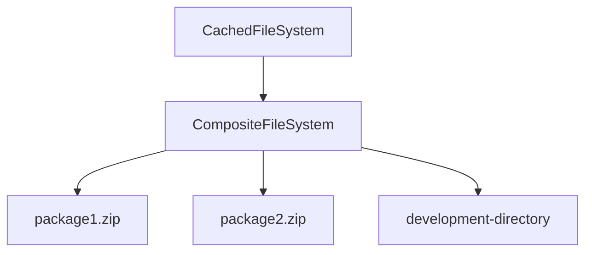

# Virtual Filesystem

A virtual filesystem provides a unified abstraction layer for read-only operations across multiple storage sources. It
seamlessly handles both native filesystem access and game package archives, while enabling distribution of translations
and downloadable content (DLC) through a standardized interface.

## Core Interface
The API provides a minimal yet comprehensive interface for read-only filesystem operations:

```csharp
class VirtualFileSystem
{
    // Returns all files in the specified directory
    ReadOnlySpan<VirtualFile> GetFiles(string path);

    // Returns all subdirectories in the specified directory
    ReadOnlySpan<string> GetDirectories(string path);

    // Returns a specific file by its path
    VirtualFile GetFile(string path);
}
```

The `VirtualFile` class provides a unified abstraction over different storage types (filesystem files, memory buffers,
or compressed package entries):

```csharp
class VirtualFile
{
    // Full path of the virtual file
    string Path { get; }

    // Size of the file in bytes
    long Length { get; }

    // Opens a stream to read the file's contents
    Stream Open();
}
```

## Implementation Types and Composition

The interface supports several specialized implementations that can be combined through composition:

Core Implementations:

- `DictFileSystem`, in-memory filesystem based on `IReadOnlyDictionary`. Useful for testing and temporary storage.
- `CompositeFileSystem`, combines multiple filesystem implementations into a single unified view.
- `CachedFileSystem`, improves performance by caching filesystem entries during initialization.
- `NativeFileSystem`, provides direct access to the operating system's filesystem.

The `VirtualFileSystemBuilder` facilitates creating optimized filesystem combinations for specific use cases. This
pattern enables:

- Flexible mixing of different storage types
- Easy addition of new implementations (e.g., ZIP-based filesystems)
- Consistent testing through `BaseVirtualFileSystemTests`

For example, you could combine a cached game package filesystem with a native filesystem during development, or layer
multiple content packages in a specific order.



## Security Considerations

This virtual filesystem implementation is designed for game content loading only and intentionally does not implement security measures.

Users should be aware of the following limitations:

- Directory traversal is possible (e.g., `nativeFileSystem.GetDirectories("..")`)
- No access control or permission system
- No file integrity verification

Usage Guidelines:

- Only use for trusted game content
- Implement security at the application level when needed
- Do not use for user-generated content without additional validation
- Consider wrapping in a secure facade if public access is required

Security measures should be implemented by the consuming application based on its specific requirements.

## No support for `async`/`await`

There are several reasons for not having asynchronous methods.

First of all it's only native filesystem that supports asynchronous methods currently and not `ZipArchive` ([source](https://github.com/dotnet/runtime/issues/1541)). `ZipArchive` is likely going to be primarly used. `NativeFileSystem` is useful for development, but not in a released game.

Games inherently work in frames and the default `SynchronizationContext` doesn't obviously respect frames. It would be possible to use frame based `SynchronizationContext` to ensure that coroutines are handled within a frame, but a proper implementation and async support in the right places is costly.

Furthermore asynchronous code raises complexity on its own where it's fairly easy to load content via threads anyway. In the end, content loading from a zip file is a mix of I/O and CPU bound operations.

## Synchronous-Only Implementation

The virtual filesystem intentionally omits `async`/`await` support for several technical and practical reasons:

- `ZipArchive`, a primary target implementation, lacks async support ([GitHub Issue](https://github.com/dotnet/runtime/issues/1541))
- While `NativeFileSystem` supports async operations, it should be primarily used during development, not in released games

There are also game-specific considerations

- Games operate on a frame-by-frame basis
- Default `SynchronizationContext` doesn't align with frame-based execution
- Implementing a frame-aware async context would add significant complexity:
  - Requires custom `SynchronizationContext`
  - Needs careful handling of frame boundaries
  - Increases implementation and testing complexity

Threading provides a simpler and more predictable solution for content loading.

## Virtual Path Format

All `VirtualFileSystem` implementations use forward slash (`/`) as the standard path separator. This ensures cross-platform compatibility
and simplifies path handling in compressed archives. E.g. valid paths:

```plaintext
dir/subdir/file1.txt
dir/subdir/file2.txt
```

## Full Path Returns

Unlike `Directory.GetDirectories`/`Directory.GetFiles` which return relative paths, `VirtualFileSystem` methods always
return full virtual paths.

For example, calling `GetDirectories("dir/subdir")` returns:

```plaintext
dir/subdir/subsubdir1
dir/subdir/subsubdir2
```

Not the relative paths:

```
subsubdir1
subsubdir2
```

## Thread-safety

All `VirtualFileSystem` implementations are thread-safe by design, with no locking overhead.

Exception: `DictFileSystem` cannot guarantee thread-safety if its underlying `Dictionary` is modified externally. To ensure thread-safety with `DictFileSystem`, either:

- Use an immutable dictionary like `FrozenDictionary`
- Don't modify the dictionary after initialization

## UNRESOLVED: Zip packages

[#21](https://github.com/stanoddly/GameKit/issues/21)
