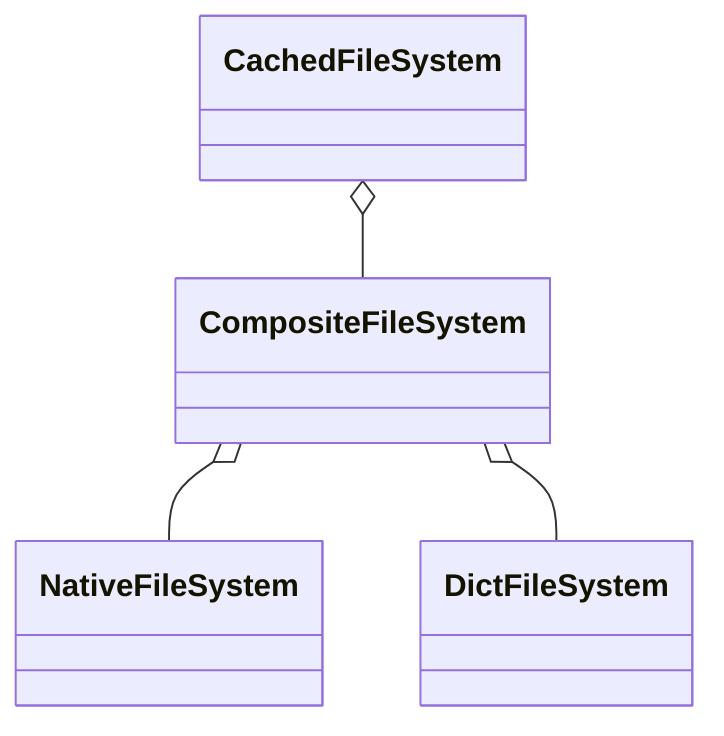

# Virtual filesystem

A virtual filesystem provides a simple abstraction for read only operations to unify access over native filesystem or game packages and provide a way to create downloadable content.

The interface it is based on is fairly simple, it could be simplified into this:

```csharp
class VirtualFileSystem
{
    ReadOnlySpan<VirtualFile> GetFiles(string path);
    ReadOnlySpan<string> GetDirectories(string path);
    VirtualFile GetFile(string path);
}
```

Based on this class interface several classes have been implemented which can be combined via composition into very useful combinations:
* `DictFileSystem` for `IReadOnlyDictionary` based fake filesystem
* `CompositeFileSystem` to combine several filesystems
* `CachedFileSystem` that cached filesystem entries on creation
* `NativeFileSystem` for a native filesystem access

They could be structured into interesting compositions:



The aspect of composition is used by `VirtualFileSystemBuilder` which can help to create the most suitable virtual filesystem.

This also opens an opportunity to create more virtual filesystems, for example based on zip, and mix them with the existing ones. `BaseVirtualFileSystemTests` exists to help with testing of new classes.

## No security

It's important to highlight that virtual filesystems are intentionally not secure.

For example it's still possible to list items out of a parent directory `nativeFileSystem.GetDirectories("..")` if `NativeFileSystem` is used directly. It's only meant to load game content, security is beyond its scope.

## No support for `async`/`await`

There are several reasons for not having asynchronous methods.

First of all it's only native filesystem that supports asynchronous methods currently and not `ZipArchive` ([source](https://github.com/dotnet/runtime/issues/1541)). `ZipArchive` is likely going to be primarly used. `NativeFileSystem` is useful for development, but not in a released game.

Games inherently work in frames and the default `SynchronizationContext` doesn't obviously respect frames. It would be possible to use frame based `SynchronizationContext` to ensure that coroutines are handled within a frame, but a proper implementation and async support in the right places is costly.

Furthermore asynchronous code raises complexity on its own where it's fairly easy to load content via threads anyway. In the end, content loading from a zip file is a mix of I/O and CPU bound operations.

## Only slash is expected in a virtual path

`VirtualFileSystem` derived classes use slash `/` instead of a backslash `\`, e.g.:

```
dir/subdir/file1.txt
dir/subdir/file2.txt
```

## Only full paths returned

Unlike with `Dictionary.GetDirectories` or `Dictionary.GetFiles` which return files relatively to a given path, `VirtualFileSystem` methods are expected to always return a virtual path, e.g. for `dir/subdir` a method `GetDirectories` would return these directories:

```
dir/subdir/subsubdir1
dir/subdir/subsubdir2
```

And not relative to `dir/subdir`:

```
subsubdir1
subsubdir2
```

## NativeFileSystem and Garbage collection

When it comes to string manipulation C# is not different. Any string manipulation leads to garbage. That being said, if

## Thread-safety

GameKit's `VirtualFileSystem` derived classes are guaranteed to be thread-safe without any locks. The only caveat is `DictFileSystem`, because a `Dictionary` could be injected and manipulated outside of the `VirtualFileSystem`.
