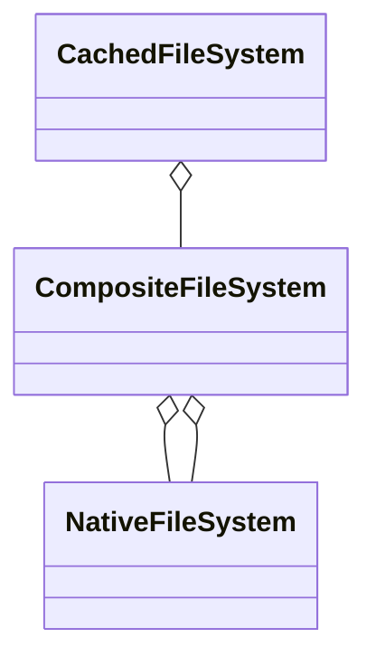

# Virtual filesystem

A virtual filesystem provides a simple abstraction for read only operations to unify access over native filesystem or game packages and provide a way to create downloadable content.

The interface it is based on is fairly simple, it could be simplified into this:
```
class VirtualFileSystem
{
    ReadOnlySpan<VirtualFile> GetFiles(string path);
    ReadOnlySpan<string> GetDirectories(string path);
    VirtualFile GetFile(string path);
}
```

Based on this class interface several classes have been implemented which can be combined via composition into very useful combinations:
* `DictFileSystem` for `IReadOnlyDictionary` based fake filesystem
* `CompositeFileSystem` to combine several filesystems
* `CachedFileSystem` that cached filesystem entries on creation
* `NativeFileSystem` for a native filesystem access

E.g.


This also opens an opportunity to create more virtual filesystems, for example based on zip.

## No security

It's important to highlight that virtual filesystems are intentionally not secure.

For example it's still possible to list items out of a parent directory `nativeFileSystem.GetDirectories("..")` if `NativeFileSystem` is used directly. It's only meant to load game content, security is beyond its scope.

## No support for `async`/`await`

There are several reasons for not having asynchronous methods.

Games inherently work in frames, the default `SynchronizationContext` doesn't obviously respect frames. It would be possible to use frame based `SynchronizationContext` to ensure that coroutines are handled within a frame, but that would increase the complexity.

It's only native filesystem that supports asynchronous methods currently and not `ZipArchive` ([source](https://github.com/dotnet/runtime/issues/1541)). `ZipArchive` that is likely going to be primarly used. NativeFileSystem is useful for development, but not in a released game.

Asynchronous code raises complexity and it's fairly easy to load content via threads anyway. In the end, content loading from a zip file is a mix of I/O and CPU bound operations.

## Read-only, immutable


## Only full paths returned

## ImmutableDictionary

## IReadOnlyDictionary

## Not smart, e.g. ..

## Inspired by Directory

## NativeFileSystem and Garbage collection

## No thread safety

https://mropert.github.io/2020/07/26/threading_with_physfs/
